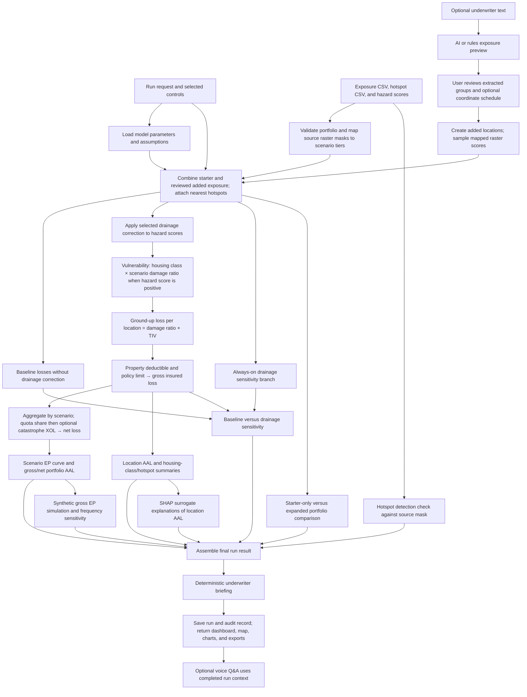
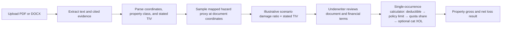

# Model analysis workflow

The portfolio result is calculated by deterministic hazard, vulnerability, and financial engines. Gemini or OpenAI can help extract optional exposure from underwriter text, but the extracted groups must be reviewed before a run. The voice assistant reads completed results; it does not calculate them.

## Portfolio run

The five displayed scenarios are **common: 1-in-10**, **occasional: 1-in-25**, **moderate: 1-in-50**, **severe: 1-in-100**, and **extreme: 1-in-250**. Their return periods are assumptions. The supplied raster mask names run in the opposite footprint order, so the source mask mapping is `extreme → common`, `severe → occasional`, `moderate → moderate`, `occasional → severe`, and `common → extreme`. A positive mapped score activates the fixed class and scenario damage ratio; the score is a constructed flood proxy, not measured water depth.

The drainage branch is an unvalidated sensitivity. The simulated EP curve uses gross scenario loss anchors; SHAP explains a fitted surrogate of location AAL. Neither changes the authoritative scenario loss calculation.

## Separate property-document calculation

This path produces an illustrative result for one document and does **not** feed the portfolio run or its EP curve.

Implementation: [`pipeline.py`](../server/app/engine/pipeline.py) orchestrates portfolio runs; [`ingestion.py`](../server/app/engine/ingestion.py), [`drainage_rule.py`](../server/app/engine/drainage_rule.py), [`vulnerability.py`](../server/app/engine/vulnerability.py), and [`financial.py`](../server/app/engine/financial.py) calculate the core stages. [`document_review.py`](../server/app/engine/document_review.py) and [`loss_terms.py`](../server/app/engine/loss_terms.py) handle the separate property path. Scenario mapping and assumptions are in [`model_parameters.yaml`](../config/model_parameters.yaml).
